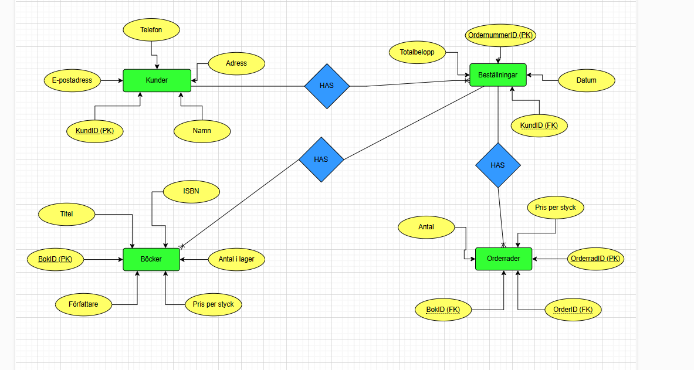

# Inlamning1 - Databaser YH2024 - Pontus Ydström
Detta repository innehåller alla mina filer för inlämningsuppgift 1 i kursen Databaser.

## Beskrivning
Denna databas är skapad för att hantera en liten bokhandel. Den innehåller tabeller för:
- Böcker
- Kunder
- Beställningar
- Orderrader

## Innehåll
- `inlamning1.sql` - En SQL-fil med min exekverbara kod.
- `er-diagram.png` - En bild av ER-diagrammet som visar databasens struktur.

## Instruktioner för användning
1. Öppna valfri MYSQL-klient.
2. Kör `inlamning1.sql` för att skapa och fylla databasen.

